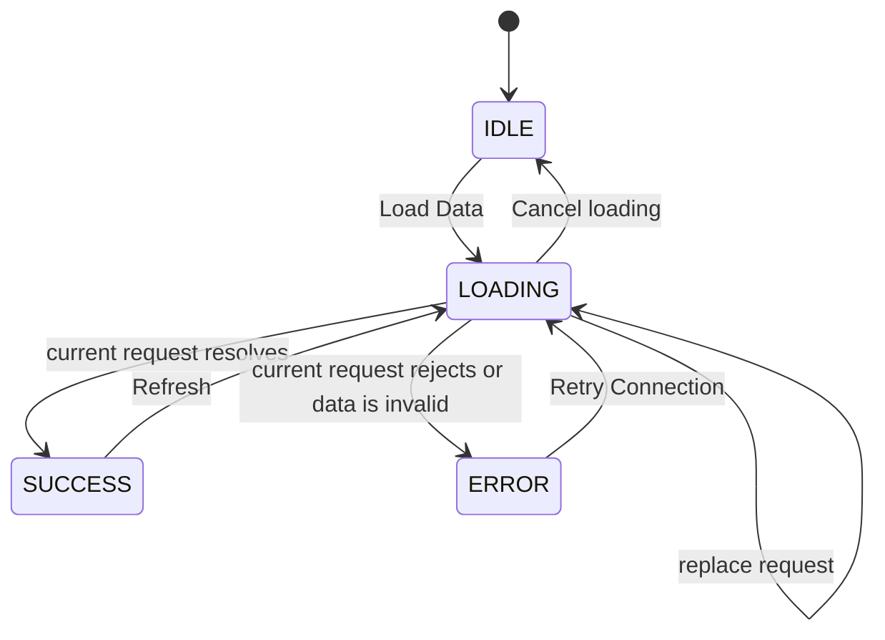

# Exercise 3 — Resilient State Machine & Skeleton Loader

A self-contained Vite + strict TypeScript demo of a local data feed with a resilient four-state UI lifecycle. The page uses DOM APIs directly; it does not depend on React or import files from Ex1/Ex2. This keeps the async controller and the state transitions visible for the exercise.

The feed is simulated with deterministic local sample data. It does not connect to a production API, backend, or external service.

## Run the app

From this `Ex3/` directory:

```bash
npm install
npm run dev
```

Vite prints the local URL. The default is `http://127.0.0.1:5173/`.

Useful commands:

```bash
npm run typecheck  # strict TypeScript check
npm test           # Vitest functional and concurrency tests
npm run build      # typecheck and production build
npm run check      # typecheck, tests, and production build in sequence
```

## Structure

```text
Ex3/
├── index.html
├── package.json
├── tsconfig.json
├── vite.config.ts
├── project-rules.md
├── TASK_DECOMPOSITION.md
├── src/
│   ├── app.ts                    # root event delegation and render boundary
│   ├── contracts.ts              # ViewState, Item, loader, and runtime guards
│   ├── data-feed-controller.ts   # request IDs, abort, state subscription, cleanup
│   ├── demo-loader.ts            # local success/error/slow/empty scenarios
│   ├── main.ts                   # browser entry point and pagehide cleanup
│   ├── renderer.ts               # semantic DOM rendering for all four states
│   ├── state-machine.ts          # pure transition function
│   └── styles.css                # responsive layout and reduced-motion skeleton
└── tests/
    ├── app.test.ts
    ├── data-feed-controller.test.ts
    ├── demo-loader.test.ts
    ├── renderer.test.ts
    └── state-machine.test.ts
```

## State contract and transitions

`ViewState<T>` is a discriminated union:

```typescript
type ViewState<T> =
  | { readonly status: "IDLE" }
  | { readonly status: "LOADING" }
  | { readonly status: "SUCCESS"; readonly data: T }
  | { readonly status: "ERROR"; readonly error: string };
```

For this feed, `T` is `Item[]`. Runtime validation checks that each item has a non-empty ID and string title/description, and rejects duplicate IDs. The renderer switches exhaustively over the four statuses. It renders only the matching branch, so old data and old errors are dropped when loading starts.



`transition()` is pure. Completion events outside `LOADING` leave the state unchanged; the controller adds the request-identity check that determines whether a completion belongs to the current load.

## Async controller, races, and cleanup

The `ItemLoader` contract accepts an `AbortSignal` and returns `Promise<Item[]>`. Starting a request follows this order:

1. Increment the request ID, detach the prior controller from active ownership, and abort that prior signal.
2. Create the new `AbortController`, make it active, and commit `LOADING`.
3. Run the loader and treat its result as `unknown` until runtime validation succeeds.
4. Commit `SUCCESS` or `ERROR` only if the controller is not disposed and the request ID and controller identity are still current.

The request ID protects the UI even when a loader ignores `AbortSignal`. A stale request's `catch` cannot produce an error, and its `finally` cannot clear the active controller for a newer request. Unknown errors are inspected safely and converted to a useful string; aborts caused by replacement or disposal are ignored.

`cancel()` invalidates and aborts the active request before moving `LOADING` to `IDLE`. `dispose()` invalidates pending requests, aborts the active request, and clears subscribers. The app removes its single root click listener and clears its root on dispose. The mock loader clears its timer and abort listener on either completion or cancellation. `main.ts` disposes the app on `pagehide`.

## UI and error handling

- **IDLE:** explains the feed and offers **Load Data**.
- **LOADING:** shows three card-shaped CSS pulse placeholders, a polite screen-reader status, `aria-busy="true"`, **Start another request**, and **Cancel loading**. Skeleton markup is `aria-hidden`.
- **SUCCESS:** shows items with stable `data-item-id` values and a **Refresh** button. An empty array gets a dedicated empty message.
- **ERROR:** shows a readable alert and **Retry Connection**. Retry invokes the loader again and returns to `LOADING`.

The renderer uses semantic elements and assigns feed/error strings through `textContent`; HTML-looking content remains text. Actions use one delegated click listener on the root, including clicks on nested button content. Rendering replaces DOM nodes without adding listeners and restores focus to the matching action when one exists in the next state.

Async request errors become `ERROR` state. Render exceptions are handled separately in `app.ts`: the app logs the render failure once, displays a DOM-built fallback with a retry action, and stops retrying the broken renderer so the fallback cannot enter a render loop.

The skeleton animation changes opacity only, which avoids repeated layout work. A `prefers-reduced-motion: reduce` rule removes the animation and transitions. Buttons include hover, focus-visible, and disabled styles. Long feed strings wrap, and the layout switches to a two-column scenario control grid on narrow screens.

## Reproduce the demo scenarios

The scenario controls are always available. Choose one, then use **Load Data** or the state-specific action.

| Scenario | What happens |
| --- | --- |
| **Success** | Loads three stable local sample items. |
| **Fail once, then retry** | The first request shows an error. **Retry Connection** starts a new request and succeeds. |
| **Slow loading** | Waits 2.4 seconds so the skeleton can be observed. Use **Start another request** to replace it or **Cancel loading** to return to IDLE. |
| **Empty feed** | Completes successfully with an empty array and displays the empty state. |

Delays are fixed; failures do not depend on randomness.

## Verification performed

Observed in this checkout:

- `npm run check` passed: strict TypeScript typecheck, all 28 Vitest tests across 5 test files, and the Vite production build.
- The build emitted a 9.27 kB JavaScript bundle and 4.94 kB CSS file before gzip (Vite reported 3.54 kB and 1.83 kB gzip respectively).
- Browser checked the local app at desktop size and at a 375 CSS-pixel content viewport. The narrow view had no horizontal overflow. The check used port 4173 because port 5173 was already occupied in the workspace.
- Browser interaction confirmed sample success, fail-once error, **Retry Connection** success, visible slow-load skeleton, keyboard activation with Enter, focus retention/focus-visible styling, live replacement of a slow request with the empty scenario, and the empty state.
- Browser console had no warnings or errors after the interaction checks.

The automated race tests use a deliberately non-cooperative loader to prove that request IDs still prevent stale writes, and verify abort, guarded `finally`, cancellation, and late completion after dispose.

Not verified with assistive hardware/software: a separate screen-reader session and an emulated `prefers-reduced-motion` browser preference. The ARIA tree was inspected in the browser, and the reduced-motion CSS rule is present, but those are not substitutes for those two manual checks.

## Scope and limits

This is a client-only educational component. Its sample feed and fail-once behavior exist only in memory; there is no remote API, authentication, persistence, backend, database, or deployment setup. The request controller is designed around one current feed request at a time; a new load intentionally replaces the previous load.
